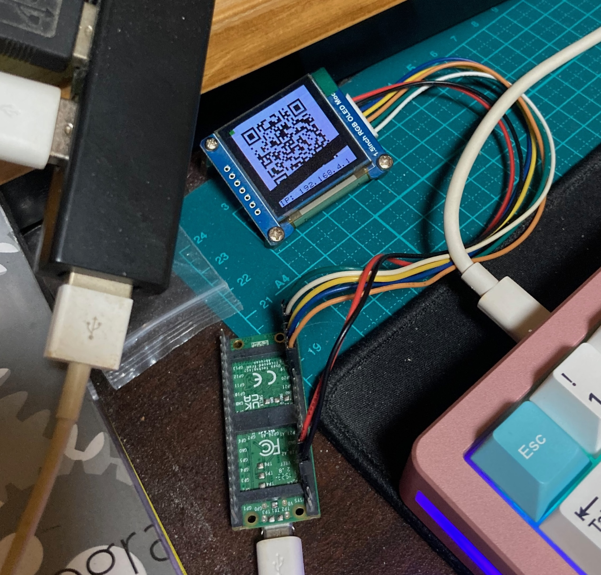

# 履歴書ガジェット

Raspberry Pi Pico WH によるポータブル履歴書

詳細は、[DesignDocs](./docs/DesignDocs.md) 参照してください。



## 用意するハードウェア

- [Raspberry Pi Pico WH](https://www.raspberrypi.com/products/raspberry-pi-pico/) (≠ Pico2 WH)
- [OLED SSD1351](https://www.waveshare.com/product/displays/lcd-oled/lcd-oled-3/1.5inch-rgb-oled-module.htm)

## 用意するソフトウェア

本リポジトリ以外に用意するソフトウェア

- Misaki Fonts

## 手順

### 初期化

一回やればいいです。

1. Open VSCode
2. Click left pane
3. Select `Initialize MicroPico project`

### 本ソフトウェア準備

```bash
git clone git@github.com:tkumata/pico1w-resumaker.git
git clone git@github.com:Tamakichi/pico_MicroPython_misakifont.git
cp -pr pico_MicroPython_misakifont/misakifont pico1w-resumaker/lib/
cd pico1w-resumaker
cp secrets.py.sample secrets.py
vi secrets.py
vi .vscode/settings.json
```

secrets.py について

| Variables    | Descriptions                      |
| ------------ | --------------------------------- |
| SSID         | SSID when Wi-Fi AP mode           |
| PASSWORD     | Wi-Fi password when Wi-Fi AP mode |
| STA_SSID     | SSID of your home Wi-Fi           |
| STA_PASSWORD | Wi-Fi password of your home Wi-Fi |

.vscode/settings.json で TTY の指定をします。Mac (M4 Macbook Air macOS Sequoia) の場合以下になります。

```json
"micropico.manualComDevice": "/dev/tty.usbmodem113201",
```

Linux (Debian 系) の場合以下になると思います。

```json
"micropico.manualComDevice": "/dev/ttyACM0",
```

### 配線

| OLED SSD1351 | Pico WH |
| ------------ | ------- |
| VCC          | 3V3     |
| GND          | GND     |
| DIN          | GP19    |
| CLK          | GP18    |
| CS           | GP20    |
| DC           | GP16    |
| RST          | GP17    |

### デプロイ

1. Pico WH を母艦 PC に接続
2. VSCode 左ペインを右クリック
3. `Upload project to Pico` を選択

### 起動

1. Pico WH を母艦 PC から外し
2. Pico WH を電源に接続

## アクセス方法

### 管理画面

1. OLED に映った QR コードをスキャン
2. ブラウザで以下にアクセス

- http://192.168.4.1/admin/user
- http://192.168.4.1/admin/simplehist
- http://192.168.4.1/admin/jobhist
- http://192.168.4.1/admin/portrait

### 履歴書表示

1. OLED に映った QR コードをスキャン
2. http://192.168.4.1 に接続
